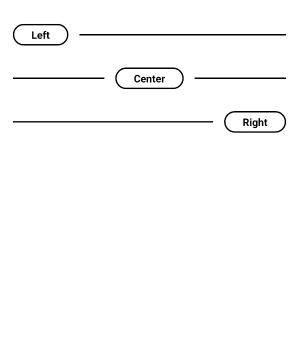

# HorizontalDivider
UI Component. Simple horizontal divider with title for android.

## Sample

## Implementation
**Step 1:** Add to project level build.gradle

    allprojects {
		repositories {
			...
			maven { url 'https://jitpack.io' }
		}
	}

**Step 2:** Add to app level build.gradle

	dependencies {
	    implementation 'com.github.u-barnwal:HorizontalDivider:VERSION'
	}
## How to use
**Create view**

    <com.isolpro.library.horizontaldivider.HorizontalDivider
      android:layout_width="match_parent"
      android:layout_height="wrap_content"
      app:title="Center"
      app:position="Center" />

|Position|Value
|---|---|
|LEFT|left|
|RIGHT|right|

## Features

 - Fully adaptive
 - Lightweight

## Links
 - Live example
   - https://pricelistlite.isolpro.in
    - https://transactionslistlite.isolpro.in
